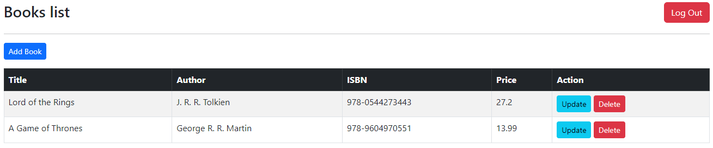
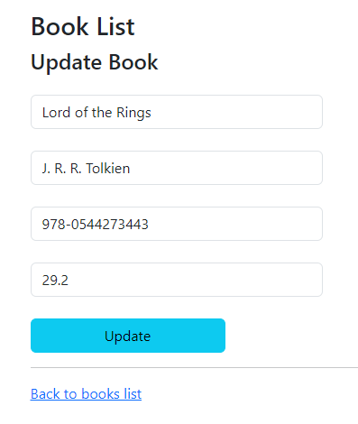
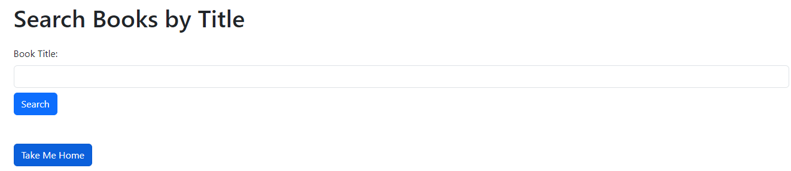
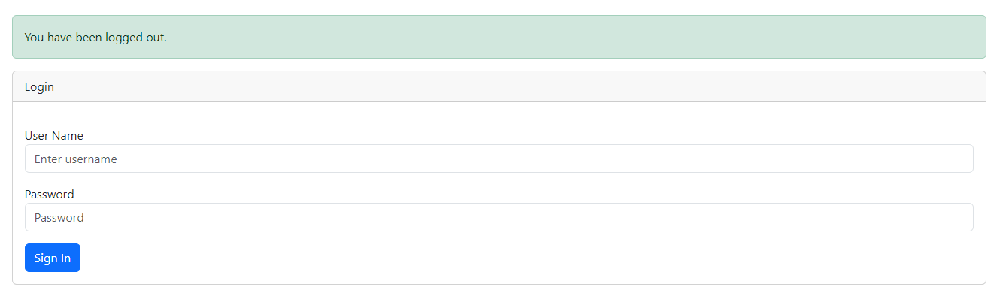

# Books App

## Description

This is a Spring Boot application for managing a list of books. The application allows users to add, update, and delete books, as well as search for books by title for further modification.

## Prerequisites

- JDK 17
- Spring Boot 3

## Role-Based Functionality

The application incorporates Spring Security to implement role-based access control. Depending on the role assigned to a user, different functionalities are available:

### User Role

- **Find Book**: Users with the "User" role can search for books by title. This is useful for finding specific books for further reading or analysis.

### Admin Role

- **Save Book**: Admins can add new books to the database, complete with all relevant details.

- **Update Book**: Admins have the privilege to update the details of existing books, such as the title, author, or ISBN number.

- **Delete Book**: Admins can remove books from the database.

## Default Credentials

### User:

- **Username**: `user`
- **Password**: `password`

### Admin:

- **Username**: `admin`
- **Password**: `adminPass`

## Security Measures

- Passwords for users and admins are encrypted using BCrypt.

- Access to different functionalities is controlled through role-based permissions, ensuring that unauthorized actions are prevented.

## Technologies Used

- **Spring Framework**
    - 
    - 
    - 
    - 
- **Frontend**
    - 
    - 
    - 
    - 
- **Others**
    - 
    - 
    - 

## Architectural Pattern

The application strictly adheres to the Model-View-Controller (MVC) architectural pattern, which allows for modular and maintainable code structure. It makes use of Spring's annotations to define Controllers, Services, and Repositories.

## Screenshots

Here are some screenshots demonstrating the functionalities of the application:

