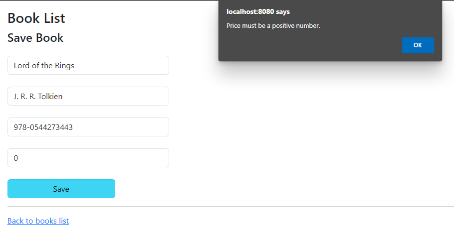

# Books App

## Description

This is a Spring Boot application for managing a list of books. The application allows users to add, update, and delete books, as well as search for books by title for further modification.

## Technologies Used

- 
- 
- 
- 
- 
-  
- 
- 

## Architectural Pattern

The application strictly adheres to the Model-View-Controller (MVC) architectural pattern, which allows for modular and maintainable code structure. It makes use of Spring's annotations to define Controllers, Services, and Repositories.

## Screenshots

Here are some screenshots demonstrating the functionalities of the application:

