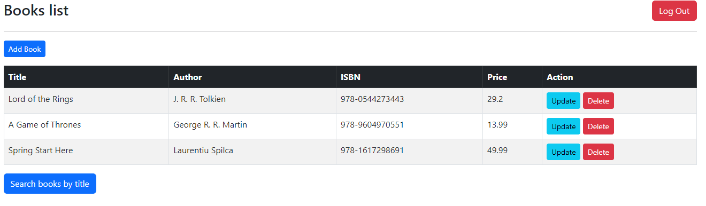

# Books App

## Description

This is a Spring Boot application for managing a list of books. The application allows users to add, update, and delete books, as well as search for books by title for further modification.

## Technologies Used

- **Spring Boot**: For the backend framework.
- **Thymeleaf**: As the template engine for rendering HTML views.
- **Spring Data JPA**: For data access, reducing boilerplate code related to database operations.
- **H2 Database**: As the in-memory database for storing book records.
- **Maven**: For dependency management.
- **HTML/CSS**: For frontend views.
- **Bootstrap**: For styling and layout.
- **JavaScript**: For client-side validation.

## Architectural Pattern

The application strictly adheres to the Model-View-Controller (MVC) architectural pattern, which allows for modular and maintainable code structure. It makes use of Spring's annotations to define Controllers, Services, and Repositories.

## Screenshots

Here are some screenshots demonstrating the functionalities of the application:

